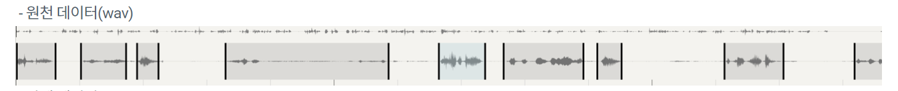

# 멀티모달 긴급도-감정 상태 판별 프로젝트

- **팀원**: 김민서(팀장), 김상윤(발표자), 이상준, 강지수, 김아람
- **기간**: 2025년 10월 17일(금) ~ 23일(목)
- **발표일**: 2025년 10월 24일 

---

## 1. 프로젝트 개요 (Introduction)

### 1.1. 프로젝트 목표

- 119 신고 음성 파일(`.wav`)과 텍스트 데이터(`.json`) 활용
- **Multi-modal** (음성+텍스트) 및 **Multi-task** (긴급도+감정) 모델을 구현하여, 접수된 신고의 **긴급도(urgencyLevel)**와 **감정 상태(sentiment)** 판별.
- AI 실무 프로세스 경험 및 딥러닝 모델 설계/적용 능력 습득을 목표.

### 1.2. 팀원 및 역할

- `김민서` : EDA, 데이터 정제 코드 작성, 데이터 전처리, HuBERT 융합 실험, default 모델 작성, 문서 작성
- `김성윤` : 베이스라인 작성 및 실험, 모델 구조 변화 실험, fine-tuning 실험, 발표 준비, 문서 작성
- `이상준` : EDA, 데이터 정제, 베이스라인 모델 튜닝, default 모델 실험, 문서 작성
- `강지수` : EDA, Robert 실험 및 융합 실험, 문서 작성
- `김아람` : EDA, 데이터 샘플링 코드 작성, task 변화 실험, fine-tuning 융합 실험, 문서 작성

---

## 2. 문제 정의 (Problem Definition)

- **주어진 과제**: 119 신고 음성과 텍스트를 입력받아, 해당 신고의 긴급도와 발화자의 감정을 동시에 분류.
- **핵심 도전 과제 (Challenge)**:
  1.  **Multi-modal**: 음성(Audio)과 텍스트(Text)라는 두 가지 다른 형태의 데이터를 어떻게 효과적으로 융합(fusion)할 것인가?
  2.  **Multi-task**: '긴급도'와 '감정'이라는 두 가지 다른 목표(task)를 하나의 모델로 동시에 학습시킬 것인가?
- **제한 사항**: 음성 파일(.wav)과 발화된 음성을 변환한 텍스트를 사용해 긴급도(urgencyLevel)와 감정 상태(sentiment)를 판별하는 멀티 모달리티, 멀티 태스크 모델을 구현.
- **원본 데이터**: [위급상황 음성/음향 (고도화) - 119 지능형 신고접수 음성 인식 데이터](https://www.aihub.or.kr/aihubdata/data/view.do?currMenu=115&topMenu=100&aihubDataSe=data&dataSetSn=71768)

    

---

## 3. 데이터 분석 및 전처리 (Data E&D & Preprocessing)

### 3.1. 사용 데이터 선정

- **데이터 출처**: AI Hub - 119 지능형 신고접수 음성 인식 데이터
- **데이터 선별**:
  - 원본 데이터(서울, 광주, 인천)의 전체 용량이 방대하여, **인천 데이터(총 `22,797`건)** 만 선별하여 사용하기로 결정.
- **학습 전략**:
  - 전체 `22,797`건 역시 초기 모델링에 많다고 판단.
  - **1단계 (모델 검증)**: `500`개의 소규모 데이터로 훈련을 우선 시도하여 모델 파이프라인 검증.
  - **2단계 (최종 학습)**: 이후 `2,000`개의 데이터를 사용하여 최종 모델 학습 진행.

### 3.2. 데이터 구조 (JSON 예시)

- 데이터는 `.wav` 오디오 파일과 매칭되는 `.json` 메타데이터로 구성.

#### 3.2.1. 원천데이터

  

#### 3.2.2. 라벨데이터

```json
{
  "_id": "64d9fdff3e12da15ae3a359e",
  "audioPath": "20230814/Incheon/2023/02/07/016/converted_20230207065612_4016-016.wav",
  "recordId": "9d7cc435cca747a1a731",
  "status": 12,
  "startAt": 0,
  "endAt": 94200,
  "utterances": [
    {
      "id": "fc2db008",
      "startAt": 25173,
      "endAt": 29406,
      "text": "부계동 어, 부계역 바로 앞에 있는 대동아파트거든요. ",
      "speaker": 0
    },
    {
      "id": "wavesurfer_otjm8pn3rq",
      "startAt": 40433,
      "endAt": 46847,
      "text": "아들 분 아드님이 어깨 탈골 돼서, 지금 그 아드님이랑 같이 있는 분 뭐, 연락처 저, 있나요?",
      "speaker": 1
    }
  ],
  "mediaType": "mobile",
  "gender": "M",
  "address": "인천광역시 부평구 부개동",
  "disasterLarge": "구급",
  "disasterMedium": "질병(중증 외)",
  "urgencyLevel": "중",
  "sentiment": "불안/걱정",
  "symptom": ["기타통증"],
  "triage": "준응급증상"
}
```

### 3.3. 주요 Feature 및 Target Label


- **Input Features (Multi-modal)**
  - **Audio**: `audioPath`를 이용해 로드한 `.wav` 파일
  - **Text**: `utterances` 내의 `text` 필드
- **Target Labels (Multi-task)**
  - **긴급도**: `urgencyLevel` ("상", "중", "하")
  - **감정**: `sentiment` ("불안/걱정", "당황/난처", "중립", "기타부정")

### 3.4. 데이터 탐색 (EDA - Exploratory Data Analysis)

- 200개 데이터의 Label 분포를 확인. (인천 `disasterLarge` 구분별 50개)

#### 3.4.1. **음성 데이터 분석**

|                                             |                                         |
| ------------------------------------------- | --------------------------------------- |
|          |       |
|  |  |

#### 3.4.2. **메타 데이터 분석**

|                                                                   |                                                          |
| ----------------------------------------------------------------- | -------------------------------------------------------- |
|                         |                   |
|             |  |
|                               |                     |
|                 |           |
|                 |        |
|  |               |
|           |            |

### 3.5. 모델 입력을 위한 전처리 (Feature Preprocessing)

- 원본 `.json`과 `.wav` 파일은 사용하기 복잡하므로, 모델 학습에 필요한 정보만 추출하여 훈련용 `train.csv` 와 `train_audio.tar` , 테스트용 `validation.csv` 와 `validation_audio.tar`파일로 통합.


#### 3.5.1. 오디오 처리 (Audio Processing)

- **입력:** 원본 `.JSON` 파일과 원본 `.WAV` 오디오 파일
- **프로세스:**
  - `.JSON` 파일에 포함된 `utterances` 정보, 특히 **`startAt`** (시작 시간)과 **`endAt`** (종료 시간) 타임스탬프 정보를 읽어와서
  - 이 타임스탬프를 기준으로, 원본 `.WAV` 파일에서 해당하는 오디오 구간을 잘라내고(slicing).
  - 하나의 원본 파일에서 여러 개의 분할된 `.WAV` 조각 파일들이 생성됨.
- **출력:** 분할된 모든 `.WAV` 조각 파일들을 하나의 **`.tar`** 아카이브 파일(예: `train_audio.tar`)로 통합.

#### 3.5.2 텍스트 및 메타데이터 처리 (Text & Metadata Processing)

- **입력:** 원본 `.JSON` 파일
- **프로세스**:
  - **텍스트(Text) 추출:** `utterances` 배열(list) 안에 나뉘어 저장된 여러 텍스트 조각들을 모두 추출하여 하나의 단일 텍스트 문자열로 결합합니다.
  - **메타데이터(Meta data) 추출:** 모델 학습에 필요한 다음 항목들을 `.JSON` 파일에서 직접 추출.
    - `gender`, `address`, ` disaster`` , ``disasterLarge` , `urgencyLevel`, `sentiment`, `symptom`, `triage`
- **출력:** 추출된 단일 텍스트와 모든 메타데이터 항목들을 컬럼(column)으로 하는 **`.csv`** 파일(예: `train.csv`)을 생성.

#### 3.5.3. 최종 통합

- 생성된 `.csv` 파일에는 각 행(데이터 샘플)이 `.tar` 아카이브 내의 어떤 오디오 조각 파일과 매칭되는지를 알려주는 **`audio_path`** (오디오 경로) 컬럼이 존재 → 이를 통해 텍스트, 메타데이터, 오디오가 하나의 세트로 연결.

---

## 4. 베이스 모델 아키텍처 (Model Architecture)

- 텍스트, 음성, 메타데이터를 입력받는 Multi-modal, Multi-task (Urgency:회귀, Sentiment:분류) 모델.
- Text Encoder: KcELECTRA
- Audio Encoder: Wav2Vec2
- Fusion: 텍스트(txt_emb)와 오디오(audio_emb) 임베딩을 Sum(+).

### 4.1. 초기 모델 구상


### 4.2. Baseline 구조


```python
class MultimodalClassifier(nn.Module):
    def __init__(self, text_model_name, meta_maps: Dict[str, Dict],
                 audio_emb_dim=256, joint_dim=256, num_classes_sentiment=4,
                 audio_input_dim=None):
        super().__init__()
        self.text_encoder = AutoModel.from_pretrained(text_model_name)
        self.text_proj = nn.Linear(self.text_encoder.config.hidden_size, joint_dim)

        if audio_input_dim is None:
            audio_input_dim = w2v_model.config.hidden_size  # wav2vec2-XLSR의 hidden dim

        self.audio_proj_shared   = nn.Linear(audio_input_dim, audio_emb_dim)
        self.audio_proj_urgency  = nn.Linear(audio_emb_dim, joint_dim)
        self.audio_proj_sentiment= nn.Linear(audio_emb_dim, joint_dim)

        self.meta_embs = nn.ModuleDict()
        for k, mapping in meta_maps.items():
            num_embeddings = len(mapping) + 1
            emb_dim = min(8, num_embeddings)
            self.meta_embs[k] = nn.Embedding(num_embeddings=num_embeddings, embedding_dim=emb_dim, padding_idx=0)
        self.meta_out_dim = sum([emb.embedding_dim for emb in self.meta_embs.values()]) if self.meta_embs else 0

        self.urgency_head = nn.Linear(joint_dim + self.meta_out_dim, 1)
        self.sentiment_head = nn.Sequential(
            nn.Linear(joint_dim + self.meta_out_dim, 256), nn.ReLU(), nn.Dropout(0.2),
            nn.Linear(256, num_classes_sentiment)
        )

    def forward(self, input_ids, attention_mask, audio_feat, meta_idx):
        B = input_ids.size(0)
        txt_out = self.text_encoder(input_ids=input_ids, attention_mask=attention_mask)
        txt_emb = self.text_proj(txt_out.last_hidden_state[:, 0, :])

        # audio_feat: (B, D, T)
        audio_mean = audio_feat.mean(dim=2)  # (B, D)
        audio_emb = self.audio_proj_shared(audio_mean)
        audio_emb_urgency  = self.audio_proj_urgency(audio_emb)
        audio_emb_sentiment= self.audio_proj_sentiment(audio_emb)

        if not self.meta_embs:
            meta_emb = torch.zeros(B, 0, device=input_ids.device)
        else:
            if meta_idx.dim() == 1:
                meta_idx = meta_idx.unsqueeze(0).expand(B, -1)
            meta_embeddings = [self.meta_embs[k](meta_idx[:, i].clamp(0, self.meta_embs[k].num_embeddings-1))
                               for i, k in enumerate(self.meta_embs.keys())]
            meta_emb = torch.cat(meta_embeddings, dim=1)

        joint_urgency   = txt_emb + audio_emb_urgency
        joint_sentiment = txt_emb + audio_emb_sentiment

        urg_out  = self.urgency_head(torch.cat([joint_urgency, meta_emb], dim=1)).squeeze(1)
        sent_out = self.sentiment_head(torch.cat([joint_sentiment, meta_emb], dim=1))
        return urg_out, sent_out
```

- **사용한 모델 (Text)**: beomi/KcELECTRA-base
  - 선정 이유: 한국어 댓글 등 구어체 데이터로 학습되어, 119 신고 STT 텍스트 처리에 적합할 것으로 판단.
- **사용한 모델 (Audio)**: facebook/wav2vec2-xls-r-300m
  - 선정 이유: 다국어 음성으로 사전 학습되어, 별도 fine-tuning 없이도 음성 특징(prosody, tone) 추출에 효과적.

---

## 5. 실험/학습

```
<!-- 실험 조건 -->
TARGET_N = 500
NUM_EPOCHS = 10
```

### 5.0. baseline

- Text: KcELECTRA, Audio: Wav2Vec2, Fusion: Sum
- 학습 그래프

    

- 테스트 결과

  ```
  Test MAE (urgencyLevel): 0.7474
  Test MSE (urgencyLevel): 0.7373
  Test Accuracy (sentiment): 0.5949
  Test Weighted F1 (sentiment): 0.4468
  ```

### 5.1. klue/roberta

- Text: klue/roberta-base로 변경
- 학습 그래프

    

- 테스트 결과

  ```
  Test MAE (urgencyLevel): 0.7884
  Test MSE (urgencyLevel): 0.8147
  Test Accuracy (sentiment): 0.5879
  Test Weighted F1 (sentiment): 0.4733
  ```

### 5.2. HuBERT

- Audio: HuBERT로 변경
- 학습 그래프

    

- 테스트 결과

  ```
  Test MAE (urgencyLevel): 0.7780
  Test MSE (urgencyLevel): 0.9159
  Test Accuracy (sentiment): 0.5837
  Test Weighted F1 (sentiment): 0.4706
  ```

### 5.3. 속성(attribute) 조절

- Meta-data 임베딩 실험
- 학습 그래프

    

- 테스트 결과

  ```
  Test MAE (urgencyLevel): 0.7443
  Test MSE (urgencyLevel): 0.7166
  Test Accuracy (sentiment): 0.5952
  Test Weighted F1 (sentiment): 0.4489
  ```

### 5.4. model 튜닝

- 학습 그래프

    

- 테스트 결과

  ```
  Test MAE (urgencyLevel): 0.8117
  Test MSE (urgencyLevel): 0.8543
  Test Accuracy (sentiment): 0.5795
  Test Weighted F1 (sentiment): 0.4732
  ```

### 5.5. Concat

- Fusion: Concat으로 변경
- 학습 그래프

    

- 테스트 결과

  ```
  Test MAE (urgencyLevel): 0.7283
  Test MSE (urgencyLevel): 0.7616
  Test Accuracy (sentiment): 0.6075
  Test Weighted F1 (sentiment): 0.5902
  ```

### 5.6. fine-tuning 일부

- Encoder 일부 Layer Fine-tuning
- 학습 그래프

    

- 테스트 결과

  ```
  Test MAE (urgencyLevel): 0.7939
  Test MSE (urgencyLevel): 0.8275
  Test Accuracy (sentiment): 0.5959
  Test Weighted F1 (sentiment): 0.4467
  ```

### 5.7. 회귀to분류

- Urgency Task: Regression -> Classification 변경
- 학습 그래프

    

- 테스트 결과

  ```
  Test Weighted F1 (urgency): 0.4195
  Test Accuracy (sentiment): 0.6215
  Test Weighted F1 (sentiment): 0.6012
  ```

### 5.8. concat + model 튜닝 + HuBERT

- 학습 그래프

    

- 테스트 결과

  ```
  Test MAE (urgencyLevel): 0.9552
  Test MSE (urgencyLevel): 1.1187
  Test Accuracy (sentiment): 0.5756
  Test Weighted F1 (sentiment): 0.5090
  ```

---

## 6. 융합 실험


## 6.1. Default ( classification, features, concat)

- 기존 base 모델에서 아래 항목을 수정하여 default 모델을 제작
- classification : 기존 모델에서 urgencyLevel을 regression에서 classification으로 수정
- features : ‘gender’, ‘disasterLarge’, ‘disasterMedium’ 만을 메타데이터 features로 반영
- concat : 오디오와 텍스트 context vector를 sum 에서 concat하는 방식 채택

- 학습 그래프

  

- 테스트 결과

  ```
  Test Accuracy (urgency): 0.3901
  Test Weighted F1 (urgency): 0.3942
  Test Accuracy (sentiment): 0.5823
  Test Weighted F1 (sentiment): 0.5273
  ```

## 6.2. [default + roberta]

**모델 : klue/roberta-base**

- 특징 : 한국어 자연어 처리에 최적화된 RoBERTa 기반 사전학습 모델, 대규모 한국어 데이터셋(KLUE Corpus)으로 학습되어 다양한 문맥 이해와 감정·의도 인식에 강점
- 선정 이유 : 한국어 긴급통화와 같이 복잡한 문맥과 감정이 혼합된 데이터를 처리하기 위해, 문맥 표현력이 우수하고 한국어 문장 구조를 잘 반영하는 klue/roberta-base을 선택

- 학습 그래프

  

- 테스트 결과

  ```
  Test Accuracy (urgency): 0.4230
  Test Weighted F1 (urgency): 0.2701
  Test Accuracy (sentiment): 0.6502
  Test Weighted F1 (sentiment): 0.5995
  ```

## 6.3. [default + hubert]

**모델 : facebook/hubert-base-ls960**

- 특징 : 음성 신호를 비지도 학습으로 전처리된 음소 단위(hidden unit)로 표현, 발화의 내용뿐 아니라 화자의 억양, 감정, 음성적 특징까지 효과적으로 인코딩하는 모델
- 선정 이유 : 긴급 통화 음성 데이터는 잡음, 억양, 감정 표현 등이 다양하기 때문에, 단순한 스펙트럼 특징보다 고수준 음성 표현을 학습할 수 있는 HuBERT 모델을 사용하여 감정 및 긴급도 분류의 정확도를 향상시키기 위해 선정

- 학습 그래프

  

- 테스트 결과

  ```
  Test Accuracy (urgency): 0.3995
  Test Weighted F1 (urgency): 0.3993
  Test Accuracy (sentiment): 0.5221
  Test Weighted F1 (sentiment): 0.5140
  ```

## 6.4. [default + 파인튜닝]

- 파인튜닝 실험에서는 **모델의 상위 2개 레이어의 가중치 학습을 허용**하여, 고수준 언어·음성 표현을 미세 조정(fine-tuning)함으로써 **도메인 적응력과 성능 향상**을 기대함.
- 기존 실험에서는 **모든 pretrained 모델의 가중치를 freeze**하고, **MLP 헤드만 학습**하도록 설정함.

- 학습 그래프
  

- 테스트 결과
  ```
  Test Accuracy (urgency): 0.4317
  Test Weighted F1 (urgency): 0.4164
  Test Accuracy (sentiment): 0.6001
  Test Weighted F1 (sentiment): 0.5885
  ```

---

## 7. 프로젝트 일지

- 10/17 금
  - 일정 수립, EDA 역할 정하기
- 10/20 월
  - 전처리 한 뒤 프로토타입 만들기
  - 모델링 세분화 / 전처리 세분화 팀 나눠서 조사
- 10/21 화
  - 모델&전처리 탐색, 오디오 데이터 압축 테스크
    - 데이터 명이나 특징 기반 프로젝트 분석해놓은 블로그 참고
    - 전처리 기법 → 대회 참고
  - baseline 코드로 테스트 환경 구성, 테스트 학습
- 10/22 수
  - 텍스트 모델 탐색, 실험 및 테스트
- 10/23 목
  - 추가 융합 실험 진행
  - 프로젝트 문서 작성

---

## 8. 결론 및 해석

### 8.1 결론

- **최고 성능 모델**: Concat 방식이 감정 분류에서 가장 우수 (Accuracy 0.6075, F1 0.5902)
- **긴급도 예측**: 전반적으로 MAE 0.72~0.95 수준으로 난이도 높음 (회귀 문제의 한계)
- **융합 실험**: roberta 적용 시 감정 분류 성능 향상 (Accuracy 0.6502, F1 0.5995)
- **파인튜닝 효과**: 상위 2개 레이어 파인튜닝으로 긴급도(0.4317), 감정(0.6001) 모두 개선
- **모달리티 융합**: Sum 방식보다 Concat 방식이 텍스트-오디오 정보 통합에 효과적

### 8.2 해석

**1. Concat > Sum: 모달리티 융합 전략의 결정적 차이**

- Sum은 서로 다른 특성(텍스트 의미 vs 음성 감정)을 평균화하여 고유 정보 손실
- Concat은 각 모달리티의 독립적 특징을 보존하여 모델이 선택적으로 학습 가능
- 실험 결과: Concat 방식이 감정 F1 0.59로 baseline 0.45 대비 32% 향상

2. **부분 Fine-tuning의 효율성**

- 상위 2개 레이어만 학습해도 urgency 0.43, sentiment 0.60으로 개선

3. **데이터 규모보다 파이프라인 검증 우선**

- 완벽한 모델보다 작동하는 end-to-end 시스템 구축이 실전 프로젝트의 핵심
- 1주일 제약에서 다양한 실험 병렬 수행으로 최적 조합 발견 (빠른 iteration)

---

## 9. 프로젝트 중 이슈 및 향후 개선 방향

- 오디오 데이터 처리 과정에서 마주친 문제들=
  - 오디오 원본 파일(.wav)의 총용량이 너무 커서, Colab/로컬 환경에서 I/O 및 처리에 시간이 과다하게 소요됨.
  - 데이터 탑재 로딩 및 분절 작업의 어려움
  - 대용량 압축파일의 압축 및 해제 과정(.zip, .tar, .tar.gz)
  - MFCC in baseline - 차원 불일치
- fine-tuning 메모리 터짐 이슈 - GPU 메모리의 한계
- 결측치 이슈 - 학습 불안정
- 잦은 요청으로 인한 구글 드라이브 블락
- 짧은 프로젝트 기간으로 최선의 성능을 위한 아이디어, 실험의 제한

---

## 10. QnA

**감사합니다.**
